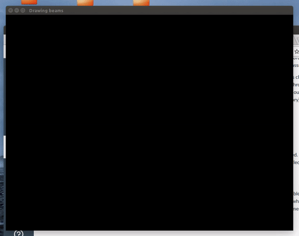

# Power Plants: Software Systems, Spring 2017
## Generative Bridge Design: an experiment in C++ to generate, evaluate, and evolve simple bridges as modeled by pin-beam truss structures.

We wanted to automate part of the bridge generation process. What an experienced engineer can do in three tries, a genetic algorithm can do in 100,000. We’ve built a system to simulate a bridge as a truss structure in real time. It solves indeterminate and determinate truss systems using gradient descent. We’ve built a way to distinguish and sort bridges based on the amount of stress on their beams. We then used this environment to produce thousands of bridges, borrow from the strongest ones, and produce realistic bridge structures at the end of several generations. 

### [Final Report Website](https://thuctran289.github.io/SoftSysPowerPlants/)

## Authors:
[Thuc Tran](https://github.com/thuctran289), [David Papp](https://github.com/davpapp), [Max Schommer](https://github.com/maxschommer), [Joseph Lee](https://github.com/JosephLee19)

## Getting started:
Required packages (tested on Ubuntu 14.04):
- g++
- build-essential
- freeglut3-dev

For a complete install on ubuntu, run:
`sudo apt-get install -y g++ build-essential freeglut3-dev`

To run, type `make` in the top directory.

## License:
[MIT License](LICENSE)
