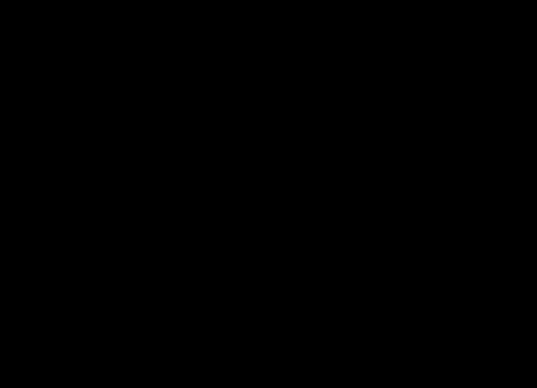
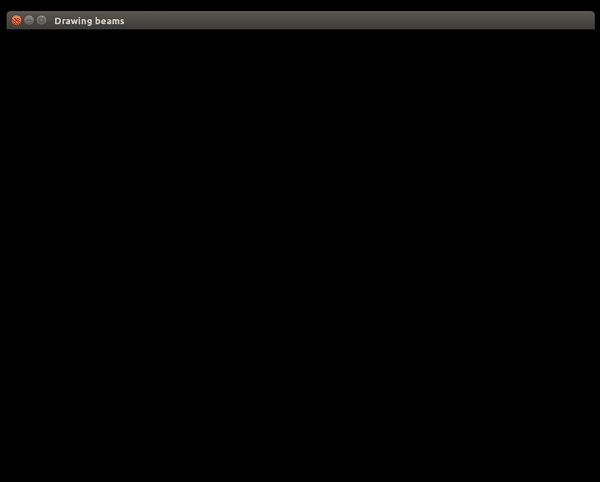
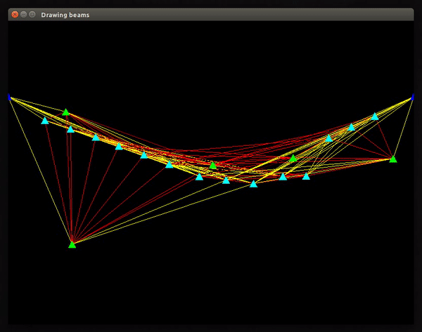
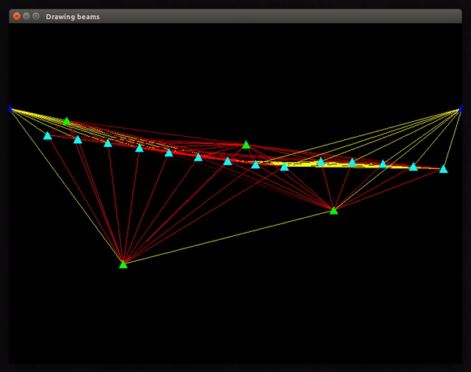

# Generative Bridge Design
## Software Systems, Spring 2017:
[Thuc Tran](https://github.com/thuctran289), [David Papp](https://github.com/davpapp), [Max Schommer](https://github.com/maxschommer), [Joseph Lee](https://github.com/JosephLee19)
An experiment in C++ to generate, evaluate, and evolve simple bridges as modeled by pin-beam truss structures.

## Bridges
We wanted to automate part of the bridge generation process. What an experienced engineer can do in three tries, a genetic algorithm can do in 100,000. We’ve built a system to simulate a bridge as a truss structure in real time. It solves indeterminate and determinate truss systems using gradient descent. We’ve built a way to distinguish and sort bridges based on the amount of stress on their beams. We then used this environment to produce thousands of bridges, borrow from the strongest ones, and produce realistic bridge structures at the end of several generations.

## Implementation
The project consists of three major components: a physics “engine”, a genetic algorithm, and a graphical display.

### _Graphics_
We created a graphic display for debugging. The display shows points, beams, and the stress on each beam by altering its color. The display was implemented using OpenGL in C++. Although OpenGL is generally overkill for 2D applications compared to other libraries like Allegro, we used it out of familiarity.

### _Physics_
We modeled a bridge as a pin-beam truss structure. This means that there are no moments on any of the points, but simply forces. This simplification made it much easier for us to solve trusses, since we didn’t have to account for bending. There are three types of truss structures: determinate, indeterminate, and unconstrained. We wanted to place a load on our truss, and calculate the forces on all of the beams. We wanted to be able to do this for all three of the truss types. That is why we chose gradient descent to approach a solution. We modeled all of the beams using Young’s modulus as the linear spring constant, and iteratively moved points in the direction that minimized force. 

### _Genetic Algorithm_
We were able to develop a genetic algorithm that effectively uses random placement of points and placement of beams in between those points to generate a realistic looking bridge. The process by which we did this was by maintaining a population of 50 bridges, sorted by the squared average stress on each of the beams. This was chosen as a metric in lieu of amount of material or costs due to a team decision to focus on stronger bridges, because we were more concerned with creating robust bridges than cheap bridges.
 
Using this this genetic algorithm, we tried to merge the best features from each generation of the population of bridges to produce new bridges that are hopefully better than the population before. The ‘genes’ of the genetic algorithm that get passed down from generation to generation are the location of pins in the structure. Points were chosen as genes due to being a relatively concise way of encoding the information of the bridge. Unfortunately, the genetic algorithm approach performed worse than the random bridge generation algorithm that we were using. A possible reason for the poor performance that was discussed is that choosing points as genes might have been too great of a simplification for how to combine bridges. For example, two good bridges could randomly swap points, and each child will be worse than the parent because the good bridges became highly specialized, and randomly combining points isn’t sufficient to merge the good qualities of both bridges. Another possible reason discussed is due to performance constraints.

### _Multi-threading_
Our design allowed for multithreading using p_thread. Even though we tried to multithread our most computationally intensive functions, we were constrained to using a smaller number of generations for simulation than what would have been desirable due to time constraints. 

## Results
We created a graphic display for debugging. This display illustrates the functionality of our physics implementation. Bridges are randomly generated and as points and beams are pulled by gravity, beams compress and stretch. The strain on each beam is illustrated by its color: as strain on a beam increases, its color fades, until eventually the beam turns yellow when it breaks.

Below are some examples of bridges generated with 10 and 15 points. The animation runs until convergence is found. Note which beams are under the most strain. 

The results of our genetic algorithm over several iterations are shown below:

Note that the bridges gradually start to resemble an actual bridge. These results are encouraging. There are still beams that break, but this is because our fitness evaluation does not explicitly penalize breaking versus simply high stress.
